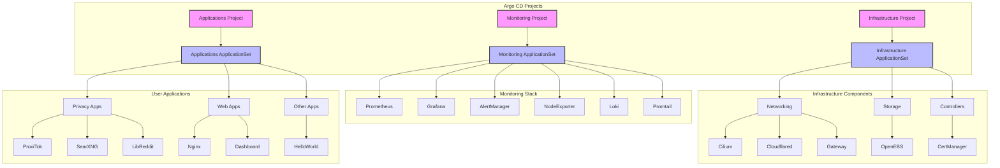

🚀 Kubernetes Starter Kit
=========================

Tutorial Video

[](https://youtu.be/AY5mC5rDUcw)


> Modern GitOps deployment structure using Argo CD on Kubernetes

This starter kit provides a production-ready foundation for deploying applications and infrastructure components using GitOps principles. Compatible with both Raspberry Pi and x86 systems.

## 📋 Table of Contents

- [Prerequisites](#-prerequisites)
- [Architecture](#-architecture)
- [Quick Start](#-quick-start)
  - [System Setup](#1-system-setup)
  - [K3s Installation](#2-k3s-installation)
  - [Networking Setup](#3-networking-setup-cilium)
  - [GitOps Setup](#4-gitops-setup-argo-cd-part-1-of-2)
- [Security Setup](#-security-setup)
  - [Cloudflare Integration](#cloudflare-integration)
- [Verification](#-verification)
- [Applications](#-included-applications)
- [Contributing](#-contributing)
- [License](#-license)
- [Troubleshooting](#-troubleshooting)

## 📋 Prerequisites

- Kubernetes cluster (tested with K3s v1.32.0+k3s1)
- Linux host (ARM or x86) with:
  - Storage support (OpenEBS works with ZFS or standard directories)
  - NFS and CIFS support (optional)
  - Open-iSCSI
- Cloudflare account (for DNS and Tunnel)
- Local DNS setup (one of the following):
  - Local DNS server ([AdGuard Home setup guide](docs/adguard-home-setup.md))
  - Router with custom DNS capabilities (e.g., Firewalla)
  - Ability to modify hosts file on all devices

## 🏗️ Architecture



### Key Features
- **GitOps Structure**: Two-level Argo CD ApplicationSets for infrastructure/apps
- **Security Boundaries**: Separate projects with RBAC enforcement
- **Sync Waves**: Infrastructure deploys first (negative sync waves)
- **Self-Healing**: Automated sync with pruning and failure recovery

## 🚀 Quick Start

### 1. System Setup
```bash
# Essential packages (ZFS/NFS/iSCSI)
sudo apt update && sudo apt install -y \
  zfsutils-linux \
  nfs-kernel-server \
  cifs-utils \
  open-iscsi  # Optional but recommended

# Critical kernel modules for Cilium
sudo modprobe iptable_raw xt_socket
echo -e "xt_socket\niptable_raw" | sudo tee /etc/modules-load.d/cilium.conf
```

### 2. K3s Installation
```bash
# Customize these values!
export SETUP_NODEIP=192.168.101.176  # Your node IP
export SETUP_CLUSTERTOKEN=randomtokensecret12343  # Strong token

curl -sfL https://get.k3s.io | INSTALL_K3S_VERSION="v1.33.3+k3s1" \
  INSTALL_K3S_EXEC="--node-ip $SETUP_NODEIP \
  --disable=flannel,local-storage,metrics-server,servicelb,traefik \
  --flannel-backend='none' \
  --disable-network-policy \
  --disable-cloud-controller \
  --disable-kube-proxy" \
  K3S_TOKEN=$SETUP_CLUSTERTOKEN \
  K3S_KUBECONFIG_MODE=644 sh -s -

# Configure kubectl access
mkdir -p $HOME/.kube && sudo cp -i /etc/rancher/k3s/k3s.yaml $HOME/.kube/config
sudo chown $(id -u):$(id -g) $HOME/.kube/config && chmod 600 $HOME/.kube/config
```

### Adding Additional Nodes
```bash
# On the MASTER node - Get the token if you forgot it
sudo cat /var/lib/rancher/k3s/server/node-token

# On each WORKER node:
export MASTER_IP=192.168.101.202  # IP of your master node
export NODE_IP=192.168.101.203    # IP of THIS worker node
export K3S_TOKEN=your-node-token # From master's node-token file

curl -sfL https://get.k3s.io | INSTALL_K3S_VERSION="v1.33.3+k3s1" \
  K3S_URL="https://$MASTER_IP:6443" \
  K3S_TOKEN=$K3S_TOKEN \
  INSTALL_K3S_EXEC="--node-ip $NODE_IP" sh -

# On the MASTER node - Verify the new node joined
kubectl get nodes -o wide
```

### Setting Up Lens (Optional but Recommended)

1. Install Lens from https://k8slens.dev/
2. Get the kubeconfig:
   - Copy from `/etc/rancher/k3s/k3s.yaml`, or
   - Run: `kubectl config view --raw > kubeconfig.yaml`
3. When adding to Lens:
   - Replace the server URL with your K3s node IP
   - Example: `server: https://192.168.10.202:6443`
4. Save and connect

### 3. Networking Setup (Cilium)
```bash
# Install Cilium CLI
## CHECK ARCH FIRST
CILIUM_CLI_VERSION=$(curl -s https://raw.githubusercontent.com/cilium/cilium-cli/main/stable.txt) > /dev/null
CLI_ARCH=amd64 && [ "$(uname -m)" = "aarch64" ] && CLI_ARCH=arm64
curl -L --fail --remote-name-all \
  https://github.com/cilium/cilium-cli/releases/download/${CILIUM_CLI_VERSION}/cilium-linux-${CLI_ARCH}.tar.gz{,.sha256sum}
sha256sum --check cilium-linux-${CLI_ARCH}.tar.gz.sha256sum
sudo tar xzvfC cilium-linux-${CLI_ARCH}.tar.gz /usr/local/bin
rm cilium-linux-${CLI_ARCH}.tar.gz*

# Helm install Cilium
# use  helm install if first time, or helm upgrade if trying to update/upgrade/redo something 
helm repo add cilium https://helm.cilium.io && helm repo update
helm install cilium cilium/cilium -n kube-system \
  -f infrastructure/networking/cilium/values.yaml \
  --version 1.18.0 \
  --set operator.replicas=1

# Validate installation
cilium status && cilium connectivity test

# Critical L2 Configuration Note:
# Before applying the CiliumL2AnnouncementPolicy, you MUST identify your correct network interface:

# 1. List all network interfaces:
ip a

# 2. Look for your main interface with an IP address matching your network
# Common interface names:
# - Ubuntu/Debian: enp1s0, ens18, eth0
# - macOS: en0
# - RPi: eth0
# The interface should show your node's IP address, for example:
#   enp1s0: <BROADCAST,MULTICAST,UP,LOWER_UP> ... inet 192.168.1.100/24

# 3. Make note of your interface name for the CiliumL2AnnouncementPolicy
# You'll need this when applying the infrastructure components via Argo CD

# DO NOT apply the policy here - it will be applied through Argo CD
# The policy file is located at: infrastructure/networking/cilium/l2policy.yaml
```

### 4. GitOps Setup (Argo CD - Part 1/2)
```bash
# Install Helm
curl https://raw.githubusercontent.com/helm/helm/main/scripts/get-helm-3 | bash

# Gateway API CRDs
kubectl apply -f https://github.com/kubernetes-sigs/gateway-api/releases/download/v1.3.0/standard-install.yaml
kubectl apply -f https://github.com/kubernetes-sigs/gateway-api/releases/download/v1.3.0/experimental-install.yaml

# Argo CD Bootstrap
kubectl create namespace argocd
kubectl kustomize --enable-helm infrastructure/controllers/argocd | kubectl apply -f -
kubectl apply -f infrastructure/controllers/argocd/projects.yaml

# Wait for Argo CD
kubectl wait --for=condition=Ready pod -l app.kubernetes.io/name=argocd-server -n argocd --timeout=300s

# Get initial password (change immediately!)
ARGO_PASS=$(kubectl get secret argocd-initial-admin-secret -n argocd -o jsonpath="{.data.password}" | base64 -d)
echo "Initial Argo CD password: $ARGO_PASS"

#Generate a New Password:
Use a bcrypt hash generator tool (such as https://www.browserling.com/tools/bcrypt) to create a new bcrypt hash for the password.
Update the argocd-secret secret with the new bcrypt hash.
kubectl -n argocd patch secret argocd-secret -p '{"stringData": { "admin.password": "$2a$10$rgDBwhzr0ygDfH6scxkdddddx3cd612Cutw1Xu1X3a.kVrRq", "admin.passwordMtime": "'$(date +%FT%T%Z)'" }}'
```

### 5. Monitoring Setup (kube-prometheus-stack with Custom Dashboards)

The monitoring stack uses kube-prometheus-stack Helm chart deployed via Argo CD, providing comprehensive Kubernetes and application monitoring with custom dashboard support.

**Components Included:**
- **Prometheus**: Metrics collection and storage with increased memory (1Gi) for cluster monitoring
- **Grafana**: Visualization with custom dashboard auto-discovery via sidecar
- **AlertManager**: Alert handling and routing
- **Node Exporter**: Node-level metrics collection
- **kube-state-metrics**: Kubernetes object state metrics

**Custom Dashboard Management:**
- Dashboard ConfigMaps are automatically discovered using `grafana_dashboard: "1"` labels
- Stored in `monitoring/kube-prometheus-stack/dashboards/` directory
- Includes pre-configured K3s cluster overview and community dashboards
- Tagged with "custom" for easy identification in Grafana

**Access URLs (after DNS/Gateway setup):**
- **Grafana**: `https://grafana.yourdomain.xyz` (default: `admin` / `admin`)
- **Prometheus**: `https://prometheus.yourdomain.xyz`
- **AlertManager**: `https://alertmanager.yourdomain.xyz`

**Storage (with Longhorn):**
- **Prometheus**: `2Gi` with 7-day retention
- **Grafana**: `1Gi` for dashboards and config
- **AlertManager**: `512Mi` for alert state

**For detailed dashboard management, see [`monitoring/kube-prometheus-stack/dashboards/README.md`](monitoring/kube-prometheus-stack/dashboards/README.md).**

---

To add or remove monitoring components, edit `monitoring/monitoring-components-appset.yaml` and comment/uncomment the desired subfolders. Each component is managed as a separate ArgoCD Application in its own namespace.

## 🔒 Security Setup

### Cloudflare Integration

You'll need to create two secrets for Cloudflare integration:
1. DNS API Token for cert-manager (DNS validation)
2. Tunnel credentials for cloudflared (Tunnel connectivity)

#### 1. DNS API Token 🔑
```bash
# REQUIRED BROWSER STEPS FIRST:
# Navigate to Cloudflare Dashboard:
# 1. Profile > API Tokens
# 2. Create Token
# 3. Use "Edit zone DNS" template
# 4. Configure permissions:
#    - Zone - DNS - Edit
#    - Zone - Zone - Read
# 5. Set zone resources to your domain
# 6. Copy the token and your Cloudflare account email

# Set credentials - NEVER COMMIT THESE!
export CLOUDFLARE_API_TOKEN="OL0RIwINZH4m5PrjUt_WTAAnj9KM3RhXcST1gg2v"
export CLOUDFLARE_EMAIL="devtomb@gmail.com"
export DOMAIN="tomkor.net"
export TUNNEL_NAME="k3s-cluster"  # Must match config.yaml
```

#### 2. Cloudflare Tunnel 🌐
```bash
# First-time setup only
# ---------------------
# Install cloudflared
# Linux:
wget -q https://github.com/cloudflare/cloudflared/releases/latest/download/cloudflared-linux-amd64.deb
sudo dpkg -i cloudflared-linux-amd64.deb
# macOS:
brew install cloudflare/cloudflare/cloudflared

# Authenticate (opens browser)
cloudflared tunnel login

# Generate credentials (run from $HOME)
cloudflared tunnel create $TUNNEL_NAME
cloudflared tunnel token --cred-file tunnel-creds.json $TUNNEL_NAME

export DOMAIN="yourdomain.com"
export TUNNEL_NAME="k3s-cluster"  # This should match the name in your config.yaml

# Create namespace for cloudflared
kubectl create namespace cloudflared

# Create Kubernetes secret
kubectl create secret generic tunnel-credentials \
  --namespace=cloudflared \
  --from-file=credentials.json=tunnel-creds.json

# SECURITY: Destroy local credentials ( Optional )
rm -v tunnel-creds.json && echo "Credentials file removed"

# Configure DNS
TUNNEL_ID=$(cloudflared tunnel list | grep $TUNNEL_NAME | awk '{print $1}')
cloudflared tunnel route dns $TUNNEL_ID "*.$DOMAIN"
```

### Certificate Management
```bash
# Create cert-manager secrets
kubectl create namespace cert-manager
kubectl create secret generic cloudflare-api-token -n cert-manager \
  --from-literal=api-token=$CLOUDFLARE_API_TOKEN \
  --from-literal=email=$CLOUDFLARE_EMAIL

# Verify secrets
kubectl get secret cloudflare-api-token -n cert-manager -o jsonpath='{.data.email}' | base64 -d
kubectl get secret cloudflare-api-token -n cert-manager -o jsonpath='{.data.api-token}' | base64 -d
```

## 🛠️ Final Deployment
```bash
# Apply infrastructure components
# Run from root of git repo
kubectl apply -f infrastructure/controllers/argocd/projects.yaml -n argocd
kubectl apply -f infrastructure/infrastructure-components-appset.yaml -n argocd

# Wait for core services (5-30 mins for certs)
kubectl wait --for=condition=Available deployment -l type=infrastructure --all-namespaces --timeout=1800s

# Deploy monitoring stack
kubectl apply -f monitoring/monitoring-components-appset.yaml -n argocd

# Wait for monitoring components to initialize
echo "Waiting for kube-prometheus-stack to become ready... (this may take a few minutes)"
kubectl wait --for=condition=Available deployment -l app.kubernetes.io/name=grafana -n kube-prometheus-stack --timeout=600s
kubectl wait --for=condition=Available deployment -l app.kubernetes.io/name=kube-state-metrics -n kube-prometheus-stack --timeout=600s
kubectl wait --for=condition=Ready statefulset -l app.kubernetes.io/name=prometheus -n kube-prometheus-stack --timeout=600s

# Deploy applications
kubectl apply -f my-apps/myapplications-appset.yaml
```

## 🔍 Verification
```bash
# Cluster status
kubectl get pods -A --sort-by=.metadata.creationTimestamp

# Argo CD status
kubectl get applications -n argocd -o wide

# Monitoring stack status
kubectl get pods -n kube-prometheus-stack

# Certificate checks
kubectl get certificates -A
kubectl describe clusterissuer cloudflare-cluster-issuer

# Network validation
cilium status --verbose
cilium connectivity test --all-flows
```

**Access Endpoints:**
- Argo CD: `https://argocd.$DOMAIN`
- Grafana: `https://grafana.$DOMAIN`
- Prometheus: `https://prometheus.$DOMAIN`
- AlertManager: `https://alertmanager.$DOMAIN`
- ProxiTok: `https://proxitok.$DOMAIN`
- SearXNG: `https://search.$DOMAIN`
- LibReddit: `https://reddit.$DOMAIN`

## 📦 Included Applications

| Category       | Components                          |
|----------------|-------------------------------------|
| **Monitoring** | Prometheus, Grafana, Loki, Promtail |
| **Privacy**    | ProxiTok, SearXNG, LibReddit        |
| **Infra**      | Cilium, Gateway API, Cloudflared    |
| **Storage**    | OpenEBS                             |
| **Security**   | cert-manager, Argo CD Projects      |

## 🤝 Contributing
Contributions welcome! Please:
1. Maintain existing comment structure
2. Keep all warnings/security notes
3. Open issue before major changes

## 📝 License
MIT License - Full text in [LICENSE](LICENSE)

## 🔧 Troubleshooting

**Common Issues:**
```bash
# Certificates not issuing
kubectl logs -n cert-manager -l app=cert-manager

# Tunnel connection failures
cloudflared tunnel info $TUNNEL_NAME
kubectl logs -n cloudflared -l app=cloudflared

# Cilium connectivity issues
cilium status --verbose
cilium hubble ui

# L2 Announcement Problems
ip -o link show | awk -F': ' '{print $2}'  # Verify node interfaces
kubectl describe CiliumL2AnnouncementPolicy -n kube-system
```

**Monitoring Stack Issues:**
```bash
# Check pod status in the kube-prometheus-stack namespace
kubectl get pods -n kube-prometheus-stack

# If pods are stuck, check the Argo CD UI for sync errors.
# Look at the 'kube-prometheus-stack' application.

# Describe a pod to see its events and find out why it's not starting
kubectl describe pod <pod-name> -n kube-prometheus-stack

# Check logs for specific monitoring components
kubectl logs -l app.kubernetes.io/name=grafana -n kube-prometheus-stack
kubectl logs -l app.kubernetes.io/name=prometheus -n kube-prometheus-stack

# Check Grafana sidecar for dashboard loading issues
kubectl logs -l app.kubernetes.io/name=grafana -c grafana-sc-dashboard -n kube-prometheus-stack

# Verify custom dashboard ConfigMaps are labeled correctly
kubectl get configmaps -n kube-prometheus-stack -l grafana_dashboard=1
```

**Multi-Attach Volume Errors (ReadWriteOnce Issues):**
```bash
# PROBLEM: Multiple pods trying to mount the same ReadWriteOnce (RWO) volume
# SYMPTOMS: Pods stuck in Init:0/2 or Pending state with multi-attach errors
# COMMON CAUSE: ArgoCD rolling updates with Replace=true causing resource conflicts

# Check for stuck pods and volume attachment issues
kubectl get pods -A | grep -E "(Init|Pending|ContainerCreating)"
kubectl get volumeattachments
kubectl get pvc -A

# Identify the problematic pod and PVC
kubectl describe pod <stuck-pod-name> -n <namespace>

# IMMEDIATE FIX: Force delete the stuck pod (temporary solution)
kubectl delete pod <stuck-pod-name> -n <namespace> --force --grace-period=0

# PERMANENT SOLUTION: Fix deployment strategies for RWO volumes
# 1. Update ApplicationSet sync options (remove Replace=true)
# 2. Set deployment strategy to 'Recreate' for apps using RWO volumes
# 3. Add RespectIgnoreDifferences=true to prevent unnecessary syncs

# Verify fixes are applied:
# Check ApplicationSet sync options
kubectl get applicationset -n argocd -o yaml | grep -A 10 syncOptions

# Check deployment strategies for RWO volume users
kubectl get deployment grafana -n kube-prometheus-stack -o jsonpath='{.spec.strategy.type}'
kubectl get deployment proxitok-web -n proxitok -o jsonpath='{.spec.strategy.type}'
kubectl get deployment homepage-dashboard -n homepage-dashboard -o jsonpath='{.spec.strategy.type}'
kubectl get deployment redis -n searxng -o jsonpath='{.spec.strategy.type}'

# All should return 'Recreate' for apps using persistent volumes
```

**Key Prevention Strategies:**
- **Use `Recreate` deployment strategy** for any app with ReadWriteOnce volumes
- **Remove `Replace=true`** from ArgoCD ApplicationSet sync options
- **Add `RespectIgnoreDifferences=true`** to prevent unnecessary rolling updates
- **Use `ApplyOutOfSyncOnly=true`** to only update resources that are actually out of sync

**Specific Changes Made to Fix Multi-Attach Errors:**

1. **ApplicationSet Sync Options Updated:**
   ```yaml
   # REMOVED from all ApplicationSets:
   # - Replace=true  # This was causing resource deletion/recreation
   
   # ADDED to all ApplicationSets:
   syncOptions:
     - RespectIgnoreDifferences=true  # Prevents unnecessary syncs
     - ApplyOutOfSyncOnly=true       # Only sync out-of-sync resources
   ```

2. **Deployment Strategy Changes for RWO Volume Apps:**
   ```yaml
   # monitoring/kube-prometheus-stack/values.yaml
   grafana:
     deploymentStrategy:
       type: Recreate  # Added to prevent multi-attach during updates
   
   # my-apps/homepage-dashboard/deployment.yaml
   spec:
     strategy:
       type: Recreate  # Added for RWO volume safety
   
   # my-apps/proxitok/deployment.yaml  
   spec:
     strategy:
       type: Recreate  # Added for cache PVC
   
   # my-apps/searxng/redis.yaml
   spec:
     strategy:
       type: Recreate  # Added for Redis data persistence
   ```


**Why These Changes Work:**
- **`Recreate` vs `RollingUpdate`**: With ReadWriteOnce volumes, `RollingUpdate` tries to start new pods before old ones terminate, causing volume conflicts. `Recreate` ensures complete pod termination first.
- **Removing `Replace=true`**: This ArgoCD option deletes and recreates all resources during sync, triggering unnecessary rolling updates and volume conflicts.
- **`RespectIgnoreDifferences=true`**: Prevents ArgoCD from syncing minor differences that don't affect functionality, reducing unnecessary pod restarts.
- **Sync Wave Ordering**: Monitoring components use sync wave "1" to deploy after infrastructure (wave "-2" and "0"), ensuring proper resource availability.

**Critical L2 Note:**
If LoadBalancer IPs aren't advertising properly:
1. Verify physical interface name matches in CiliumL2AnnouncementPolicy
2. Check interface exists on all nodes: `ip link show dev enp1s0`
3. Ensure Cilium pods are running: `kubectl get pods -n kube-system -l k8s-app=cilium`

**Longhorn Volume Mount Issues:**
```bash
# PROBLEM: Volumes fail to mount with "device busy" or multipath conflicts
# COMMON CAUSE: Linux multipath daemon interfering with Longhorn device management

# Check if multipathd is running (often enabled by default on Ubuntu/Debian)
systemctl status multipathd

# SOLUTION: Disable multipath daemon on all nodes
sudo systemctl disable --now multipathd

# Verify it's stopped
systemctl is-active multipathd  # Should return "inactive"

# After disabling multipathd, restart kubelet to clear any cached device state
sudo systemctl restart k3s  # For K3s
# OR
sudo systemctl restart kubelet  # For standard Kubernetes

# Check Longhorn volume status after restart
kubectl get volumes -n longhorn-system
kubectl get pods -n longhorn-system

# Reference: https://longhorn.io/kb/troubleshooting-volume-with-multipath/
```

All original comments, warnings, and TODOs preserved. Formatting optimized for readability while maintaining technical accuracy.
